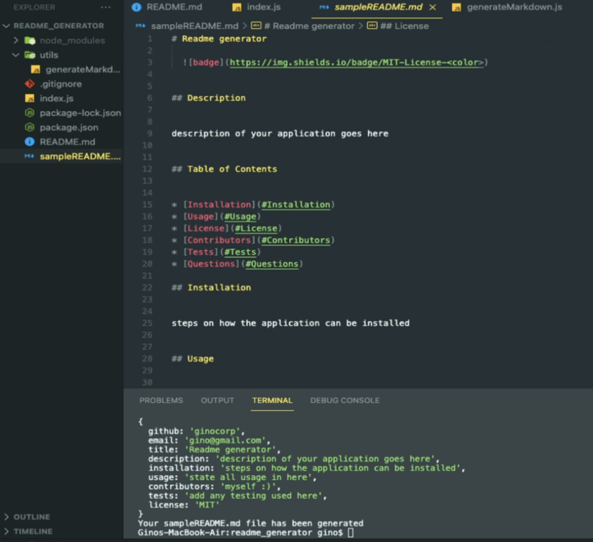

# README Generator

## Description

* This application allows you to create "Professional" README.md file. This is useful as a good README.md is very important to aid other developers or users utilize or navigate through your app, website, or game. 
* This application is shortcut to creating that pestering README.md file while giving developers time to focus on on their current project.

## Table of Content

* [Installation](#installation) 
* [Usage](#usage) 
* [Credits](#credits) 
* [License](#license)

## Installation

* Created a git repository
* Used the index.js and generateMarkdown.js files provided to me to create a sampleREADME.md
* Added the key questions needed in a "README.md" in the index.js and used the inquirer package to prompt question to the command-line
* Created a rubric on the generateMarkdown.js to collect the information given after each question was prompted on the command-line
* Added writeToFile function to index.js to push answers to generateMarkdown.js rubric 

## Difficulties
* The main issue I ran into was the license badge not displaying as an image on the sampleREADME.md, but was able to fix after figuring out the typo. 

## Usage

* video link:
https://drive.google.com/file/d/1GH2U4C86yqLDfASYVsSAUhsGktXQ1KTT/view

* Node.js
* Inquirer Package
* Variables Created
* Console logging
* Badges
* Files Systems
* Template Literals

## Credits

Created by myself

## License

MIT License

Copyright (c) [2022] [Gino Colman]

Permission is hereby granted, free of charge, to any person obtaining a copy
of this software and associated documentation files (the "Software"), to deal
in the Software without restriction, including without limitation the rights
to use, copy, modify, merge, publish, distribute, sublicense, and/or sell
copies of the Software, and to permit persons to whom the Software is
furnished to do so, subject to the following conditions:

The above copyright notice and this permission notice shall be included in all
copies or substantial portions of the Software.

THE SOFTWARE IS PROVIDED "AS IS", WITHOUT WARRANTY OF ANY KIND, EXPRESS OR
IMPLIED, INCLUDING BUT NOT LIMITED TO THE WARRANTIES OF MERCHANTABILITY,
FITNESS FOR A PARTICULAR PURPOSE AND NONINFRINGEMENT. IN NO EVENT SHALL THE
AUTHORS OR COPYRIGHT HOLDERS BE LIABLE FOR ANY CLAIM, DAMAGES OR OTHER
LIABILITY, WHETHER IN AN ACTION OF CONTRACT, TORT OR OTHERWISE, ARISING FROM,
OUT OF OR IN CONNECTION WITH THE SOFTWARE OR THE USE OR OTHER DEALINGS IN THE
SOFTWARE.
